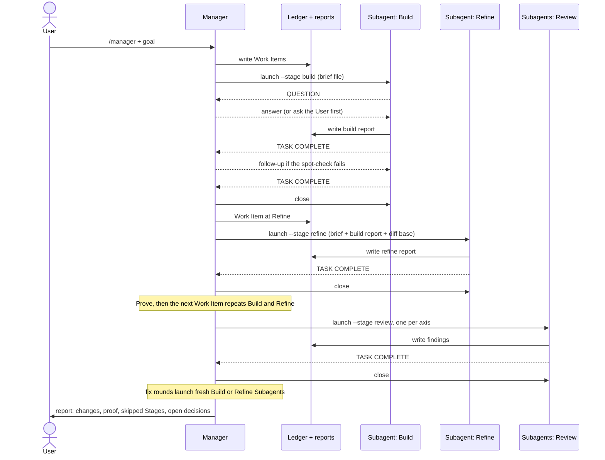

# Agent workflow

How a goal moves from the user's request to a shipped change. Terms are
defined in [GLOSSARY.md](../GLOSSARY.md); the decisions behind this shape are
[ADR 0002](adr/0002-manager-on-request.md) and
[ADR 0003](adr/0003-subagent-is-a-stage-instance.md).

## Flow

Rounded boxes run in the Manager's own session. Hexagons are Subagents: each
is a fresh session for one Stage of one Work Item, launched with

```mermaid
flowchart TD
    req([User request]) --> mgr{"/manager invoked?"}
    mgr -- no --> plain(["Plain agent does the work itself<br/>no Ledger, no Subagents"])
    mgr -- yes --> shape{"Goal or approach open?"}
    shape -- yes --> grill(["Shape: grill the user"])
    shape -- no --> split
    grill --> split(["Split the goal into Work Items<br/>write the Ledger"])

    split --> next(["Take the next Work Item"])
    next --> trivial{"Trivial?"}
    trivial -- yes --> selfbuild(["Manager builds it"])
    selfbuild --> cheapprove(["Prove: scoped lint and tests<br/>read own diff"])
    cheapprove --> done

    trivial -- no --> facts{"Needs outside facts?"}
    facts -- yes --> research{{"Research"}}
    facts -- no --> design
    research --> design{"State model, UI, or<br/>interface undecided?"}
    design -- yes --> designstage(["Design: codebase-design with the user<br/>prototype Subagent if needed"])
    design -- no --> cause
    designstage --> cause{"Bug with unknown cause?"}
    cause -- yes --> diagnose{{"Diagnose"}}
    cause -- no --> kind
    diagnose --> kind{"Code or prose?"}
    kind -- code --> build{{"Build"}}
    kind -- prose --> write{{"Write"}}
    build --> refinep{"Added behaviour or<br/>reshaped a module?"}
    refinep -- yes --> refine{{"Refine"}}
    refinep -- no --> prove
    refine --> prove(["Prove: scoped lint and tests"])
    write --> prove
    prove --> visible{"User-visible change<br/>tests don't observe?"}
    visible -- yes --> verify{{"Prove: verify-app"}}
    visible -- no --> done
    verify --> done(["Mark the Work Item done in the Ledger"])

    done --> more{"More Work Items?"}
    more -- yes --> next
    more -- no --> budget{"Change Set needs Review?<br/>(proof budget)"}
    budget -- no --> report
    budget -- yes --> review

    subgraph review [Review: in parallel, critique model, read-only]
        standards{{"Standards"}}
        spec{{"Spec"}}
        debt{{"Debt"}}
    end

    review --> findings{"Findings?"}
    findings -- none --> report
    findings -- "needs the user" --> ask(["Ask the user"])
    ask --> findings
    findings -- Spec --> fixbuild{{"Build: fix round"}}
    findings -- "Standards / Debt" --> fixrefine{{"Refine: fix round"}}
    fixbuild --> recheck(["Re-check that fix only"])
    fixrefine --> recheck
    recheck --> findings

    report(["Report to the user"]) --> ship{"User asks to ship?"}
    ship -- yes --> shipstage(["Ship: commit-changes, visual-pr"])
    ship -- no --> stop(["Stop: work stays uncommitted"])
```

`subagent.py --stage <stage>`.

Defaults the flow leaves implicit:

- Work Items run one after another in one worktree, and Review runs once over
  the Change Set. Items that touch disjoint code may run in parallel, each in
  its own worktree; items that ship as separate PRs go through Review one by
  one.
- At most one Subagent edits a worktree at a time. Review Subagents only read,
  so they share it.
- The Manager asks the user instead of looping when a decision belongs to the
  user, when a finding comes back after its fix, or when reviewers disagree
  with the spec itself.

Some Stage skills (grilling, tdd, review, zero-tech-debt and others) are not in
this repository: they come from the shared checkout at `~/work/prefapp/skills`.
`ls -l ~/.agents/skills` shows which checkout supplies each installed skill, and
`just doctor` reports repo-owned links that dangle.

## Sessions

Every Subagent talks only to the Manager; the user talks only to the Manager.
Sessions hand work over through files: the brief going in, the report coming
out, the diff in the worktree, and the Ledger.

